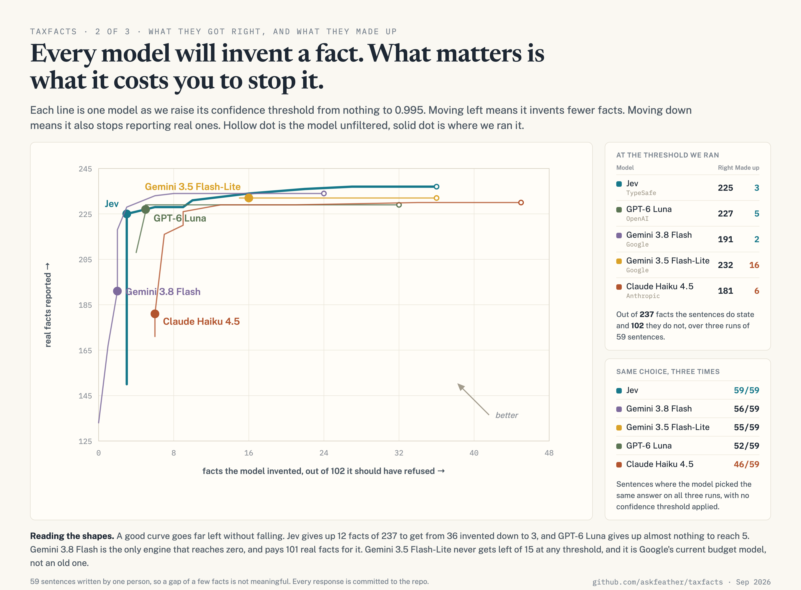

# Benchmark method

Every response we measured is committed under `bench-data/`. You can reproduce
every number in the README with no API key and no network:

```bash
npx tsx scripts/bench.ts --engine jev --model-paths
npx tsx scripts/bench.ts --engine luna-direct --model-paths
npx tsx scripts/bench.ts --engine flash-lite-3.5 --model-paths
npx tsx scripts/bench.ts --engine flash-3.8 --model-paths
npx tsx scripts/bench.ts --engine haiku-direct --model-paths
npx tsx scripts/bench.ts --engine flash --model-paths        # 2.5, previous gen
npx tsx scripts/bench.ts --engine flash-lite --model-paths   # 2.5, previous gen
```

`--model-paths` scores only the four paths a model fills, which is what the
published tables report. Without it the harness also counts the three a regex
fills, which every engine gets right, so the `correct` column sits 57 higher on
every row.

To re-measure against the live APIs, `--live --runs 3` and an
`OPENROUTER_API_KEY`. The full sweep across all seven engines cost about $12.

## The question this measures

Not "which model is smarter". **Given a sentence a taxpayer wrote, which model
can be trusted to say what it does not know?**

That is a different question from accuracy, and the two come apart. The most
accurate engine here is also the one that asserts the most things the text
never said.

## The corpus

59 cases in `fixtures/`. Each is a sentence plus two lists:

- `expect` - facts the sentence **does** determine, with their values. Failing
  to produce one is a **miss**. Producing it with the wrong value is a
  **wrong value**.
- `abstain` - facts the sentence does **not** determine. Producing one at all
  is an **overreach**.

106 expected facts and 42 required abstentions, so **72% of the judgements
reward answering and 28% reward refusing.**

That balance is deliberate and it is the first thing to check if you are
suspicious of the result. A corpus weighted toward ambiguity would hand the win
to whichever engine abstains most, regardless of whether it is right to. This
one is weighted the other way, against the conclusion it reaches.

Three groups:

1. **Stated plainly.** Filing status, age, state, blindness, given directly or
   with mild indirection ("I've lived in Boise my whole life").
2. **Traps.** A plausible wrong value is present and adjacent: a sibling's
   state, an employer's headquarters, a spouse's age where the filer's is
   absent, a deceased spouse, a hypothetical marriage, an EIN shaped like an
   SSN, a phone number containing a five-digit run, a prior year's filing
   status stated before the current one, and text that instructs the extractor
   instead of describing a taxpayer.
3. **Genuinely undetermined.** Married but no method chosen, "I live in
   Portland" with no state, a doctor raising the possibility of legal
   blindness, a move that has not completed.

Plus out-of-domain text that should be refused outright.

Every case is synthetic. See `fixtures/LICENSE`.

## What is compared

Each vendor's current cheap, fast model - the one it sells for small repetitive
work - plus the two previous-generation Google models, kept because they are
where the confidence saturation is most extreme.

| engine | vendor | route | in / out per M |
|---|---|---|---|
| `typesafe/jev-1.13` | TypeSafe | OpenRouter | $0.042 / n/a |
| `gpt-6-luna` | OpenAI | origin | $0.10 / $0.50 |
| `gemini-3.5-flash-lite` | Google | Vertex | $0.30 / $2.50 |
| `gemini-3.8-flash` | Google | Vertex | $0.75 / $3.75 |
| `claude-haiku-4-5` | Anthropic | origin | $1.00 / $5.00 |
| `google/gemini-2.5-flash` | Google | OpenRouter | $0.30 / $2.50 |
| `google/gemini-2.5-flash-lite` | Google | OpenRouter | $0.10 / $0.40 |

Jev is a decision model: it returns a probability distribution over a
caller-supplied option set, generates no tokens, and cannot emit a string. The
others are general models asked for the same distributions under a strict
schema.

All of them receive the same questions, the same option lists and the same
criteria text. **The route is not common**, so latency is not a like-for-like
model comparison - see Limitations.

## Making the comparison fair

**One confidence scale.** Jev reports a chance-corrected confidence. We
recovered the formula from its responses - a choice at p=0.63 over 6 options
reports 0.54, and p=0.99 over 52 reports 0.99, both within Jev's 0.01
quantisation of `(p_max - 1/K) / (1 - 1/K)` - and compute it identically for the general
models. Without this a single threshold would mean different things on
different scales and the comparison would be meaningless.

**Verbalized probabilities, not logprobs.** The general models are asked to
emit a probability per option under a strict schema. This is the approach
TypeSafe's own reference adapter takes. Token logprobs would be a different and
arguably fairer test, and are not done here - see Limitations.

**Cached, then swept offline.** Each engine is called once per case per run,
the raw responses are stored, and the thresholds are applied afterwards. This
matters: confidence moves between identical calls, so re-calling at each
threshold would measure that drift rather than the threshold.

**Three runs per case**, because the same input can flip a fact between runs.
The `flaky` column counts cases whose fact set
was not identical across all three.

## One shared threshold, and the whole sweep

The headline table scores every engine at the same gate, 0.95. A shared
threshold is the honest default: it is what a caller would actually set, and
giving each engine its own best number turns a measurement into a search.

The full sweep is printed by the harness and drawn below, because the shared
gate hides the thing that matters most about an engine - whether the threshold
does anything at all. Reading an engine's overreach column down the sweep is
how you tell. Gemini 3.5 Flash-Lite moves from 17 to 15 across the entire
range; Gemini 2.5 Flash does not move at all.

Scoring each engine at its own best threshold under a stated over-assertion
budget is the obvious alternative and a worse one: it flatters whichever engine
sits near a budget boundary, and it can make two engines look tied when they are
not.

## The sweep

Eight thresholds from 0.50 to 0.995. Four outcomes, deliberately not collapsed
into one score:

- **correct** - an expected fact, produced, right value
- **wrong value** - an expected fact, produced, wrong value
- **missed** - an expected fact, not produced
- **overreach** - a fact the corpus says is not determinable, produced anyway

`missed` and `overreach` are not symmetric and should never be averaged
together. A missed fact becomes a question put to the client. An overreach
becomes a number on a return that nobody was asked to confirm.

## Risk-coverage

Each engine swept from no threshold to 0.995, on the four model-answerable
paths, three runs. Up and to the left is better: fewer invented facts without
giving up the real ones.



Three shapes appear. Jev and GPT-6 Luna turn sharply left and stay high: they
buy safety cheaply, giving up 12 and 2 facts respectively to get from 36 and 32
invented down to 3 and 5. Gemini 3.8 Flash and Claude Haiku fall as they
tighten, paying real facts for each invented one they remove. Gemini 3.5
Flash-Lite barely moves at all, because its over-assertions sit above every
reachable threshold.

Only Gemini 3.8 Flash reaches zero invented facts, at 0.99, keeping 133 of 237.

## Limitations

**One author.** Every judgement about what a sentence determines is one
person's, and that person does not prepare tax returns for a living. This is
the largest threat to the result and the reason the corpus is the first item on
the roadmap.

**59 cases is small.** Differences of a few counts are not meaningful. The
findings that survive are the large ones: an order of magnitude on cost, a
factor of five on latency, one engine whose choice never changed against four
that did, and a threshold that barely moves on Gemini 3.5 Flash-Lite while it
works on everything else.

**Five current engines, four vendors**, one model each beyond Gemini. That is
not enough to support a conclusion about model class, so treat any
generalisation here with care.

**Anthropic rejects `temperature`** on these models as deprecated, so Haiku is
the only engine here that cannot be pinned, and part of its run-to-run spread is
sampling rather than the model, so its non-determinism column is not strictly
comparable with the others. Every other engine is pinned: both Gemini models
and GPT-6 Luna send `temperature: 0`, and Jev has no temperature setting because
it has no sampler.

**Anthropic's schema constrains property keys** to `^[a-zA-Z0-9_.-]{1,64}$`, so
fact paths are flattened on the wire for that engine and mapped back
before scoring. The question text, options and descriptions are unchanged.

**Cost is measured, latency is not comparable.** Cost is measured input and
output tokens at each vendor's published price, on one fixed sentence over ten
calls; where the gateway also billed the call its own figure agreed to within
2%. Latency crosses three networks - a gateway, Vertex, and two origins - so a
few hundred milliseconds between two engines is a fact about the route, not the
model.

**Google's 3.x models are called through Vertex** on a Google Cloud project,
because the gateway balance would not cover the run. Same prompt, same schema,
same confidence formula; thinking is disabled, since no other engine here
reasons and leaving it on would compare two different things.

**The shared gate was chosen on one engine.** 0.95 is the top of Jev's plateau,
measured on these same 59 fixtures with no held-out split. Using one shared gate
across engines is the right call; searching for its value on one of them is a
weakness, and the by-gate determinism table in the README is published so the
sensitivity is visible. At a gate of 0.80 both the determinism gap and the
over-assertion gap narrow considerably.

**Only the general models receive the system prompt.** `SYSTEM` in `src/llm.ts`
is sent by every general-model backend and contains two lines of abstention
coaching. Jev's API takes no system message, so it never sees them. This helps
the general models on over-assertion, the metric the benchmark leads with, and
therefore biases against the decision model. The same content belongs in the
per-question `instructions`, which both engines receive, and moving it there is
the first thing a second version should do.

**The in-domain screen is close to inert here.** Disabling `IN_DOMAIN_FLOOR`
entirely leaves the over-assertion count unchanged for all five headline
engines, and forces no expected fact into `missed` for any of them. It fires
7 to 16 times per 177 calls depending on the engine, and on one genuine fixture
for Jev. It is a real mechanism, but it is not doing the work the README's
"three mechanisms" framing implies on this corpus.

**The reported spread is the max of ten, not a p95.** `scripts/cost-latency.ts`
indexes the tenth of ten samples. The field is named `p95` in the JSON and that
name is wrong.

**Input-token accounting is not comparable across providers.** On the same
sentence and the same schema: 2,319 tokens (Vertex), 2,397 (Anthropic), 1,063
(OpenAI), 118 (OpenRouter). Jev's 860 comes from the same gateway that reports
118, so it is not the under-counted figure, but the cost multiples over the
Vertex and Anthropic engines carry this uncertainty. The multiple over GPT-6
Luna, origin to origin, does not.

**This is selective prediction**, formalised by Geifman and El-Yaniv, normally
summarised with risk-coverage curves and AURC. This document reports the curve
and deliberately does not collapse it to a single statistic, but the framework
is standard and predates us; see also ["The Score Granularity
Gap"](https://arxiv.org/abs/2606.22179) on verbalized-confidence resolution.

**Verbalized probabilities are not the only option.** Constrained decoding with
token logprobs might give the general models a better-calibrated signal. If it
does, that changes the conclusion and we would like to know.

**One task.** Sixteen filer-level fields. Nothing here says anything about how
these models behave on document classification, routing, or anything else.

**The prompt was not tuned per engine.** Each gets the same criteria text.
Tuning per model would likely help every general model here and would make the
comparison less clean.

**Independent benchmarks disagree on the general question.** Other published
evaluations put a frontier general model ahead of this decision model on both
accuracy and calibration error, and at least one reports the decision model
changing its answer on a small fraction of repeated calls. That is consistent with what we found -
the general model here is the most accurate. What we measured is different:
whether the confidence number is usable as a threshold. On this task it is for
one engine and not the others.

## Reproducing, extending, disputing

The scoring path is about 535 lines. If you think the corpus is loaded, the
thresholds are chosen to flatter, or the schema disadvantages the general
models, the data is in `bench-data/` and the scorer is in `src/score.ts`.

Open an issue with a case we get wrong. That is worth more to us than agreement.
